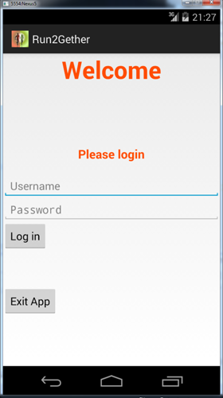
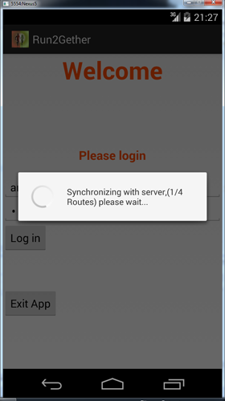
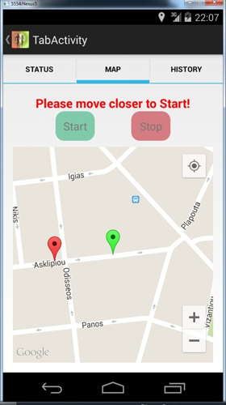
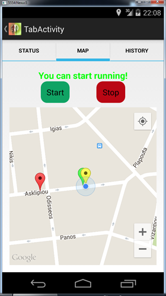
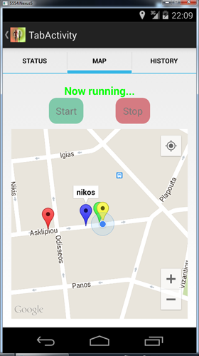

# Run2gether app
Το Run2gether είναι μια Android εφαρμογή βελτίωσης φυσικής κατάστασης και ευεξίας.  

Ο χρήστης Α κάνει μια νέα καταχώρηση διαδρομής και αφού τη διανύσει καταγραφονται η εκκινηση, ο τερματισμος και τα γεωγραφικα στιγματα (κάθε 10 δευτερολεπτα).  
 
Αργότερα όταν ο χρήστης Β επιλέξει να διανύσει την ίδια διαδρομή, έχει την δυνατότητα καθώς την διανύει να βλέπει που βρισκόταν ο χρήστης Α την αντίστοιχη χρονική στιγμή.  
  
   
  
   
  
  

## Οδηγίες εγκατάστασης ##
1. Εγκατάσταση [Java (JDK) ] (http://www.oracle.com/technetwork/java/javase/downloads/jdk8-downloads-2133151.html)  

2. Λήψη του [Eclipse] (http://www.eclipse.org/downloads/packages/eclipse-ide-eclipse-committers-450/marsr) . Δεν χρειάζεται εγκατάσταση, αποσυμπιέζετε και τρέχετε το eclipse.exe  

3. Κατεβαστε τα Android SDK Tools από[εδώ](http://developer.android.com/sdk/index.html#Other) επιλέγοντας SDK Tools Only. Τρέχοντας τον installer κατεβαίνουν τα SDK Tools και στη συνέχεια ξεκινάει η εγκατάσταση.  

4. Τρέξτε το Android SDK Manager και κατεβάστε τα παρακάτω έξτρα πακέτα:

  * Tools -> Android SDK tools 23.0.5
  * Tools ->Android SDK Platform-tools 21
  * Android 4.4.2(API 19) -> SDK Platform
  * Android 4.4.2(API 19) -> Google APIs
  * Extras > Android Support Repository
  * Extras > Android Support Library
  * Extras > Google Play services
  * Extras > Google Repository

5. Για την εγκατάσταση των Google Play Services στο Eclipse και την δημιουργία προσωπικού κλειδιού για τα Google Maps θα βρειτε αναλυτικές οδηγίες [εδώ] (http://www.androidhive.info/2013/08/android-working-with-google-maps-v2/)  

6. Google Analytics  

Αν επιθυμείτε να ενσωματώσετε Google Analytics στην εφαρμογή πρέπει να ακολουθήσετε τις οδηγίες [εδώ] (http://www.google.com/analytics/mobile/) για να φτιάξετε λογαριασμό και αφού δημιουργήσετε ένα Report να συμπληρώσετε το ga_trackingId στο αρχείο \res\xml\app_tracker.xml  

## Βάση Δεδομένων ##
1. Για τη δημιουργία της βάσης δεδομένων χρειάζεται να εγκαταστήσετε ένα admin εργαλείο για SQLite. Προτείνεται το [SQLiteman] (http://sqliteman.yarpen.cz/)
2. Στη συνέχεια θα πρέπει να δημιουργήσετε το παρακάτω σχήμα:  

```
CREATE TABLE "routes" (
    "route_id" INTEGER PRIMARY KEY AUTOINCREMENT NOT NULL,
    "start_latitude" REAL,
    "start_longitude" REAL,
    "finish_latitude" REAL,
    "finish_longitude" REAL,
    "route_name" TEXT
);
CREATE TABLE sqlite_sequence(name,seq);
CREATE TABLE "users" (
    "user_id" INTEGER PRIMARY KEY AUTOINCREMENT NOT NULL,
    "username" TEXT,
    "password" TEXT
);
CREATE TABLE points ("point_number" INTEGER PRIMARY KEY AUTOINCREMENT NOT NULL,"user_id3" INTEGER,"route_id3" INTEGER,"latitude" REAL,"longitude" REAL,"repetition" INTEGER);
CREATE TABLE android_metadata (locale TEXT);
CREATE TABLE "history" (history_id INTEGER PRIMARY KEY AUTOINCREMENT NOT NULL,"user_id2" INTEGER,"route_id2" INTEGER,"date" TEXT,"distance" REAL,"avg_speed" REAL);   
```  


Στον φάκελο assets υπάρχει ήδη μια βάση με το παραπάνω σχήμα αλλά χωρίς δεδομένα


3. Στη συνέχεια πρέπει να δημιουργήσετε κάποιους χρήστες με την παρακάτω εντολή:  

```
insert into users(username,password) values ('<username>','<password>');   
```  

όπου στο <username> και <password> βάζετε τις τιμές που θέλετε.  

4. Αποθηκεύετε τη βάση που δημιουργήσατε με το όνομα fitnessDb και την αντιγράφετε στο path ./assets

## Συγχρονισμός με server ##

Στην εφαρμογή έχει υλοποιηθεί επίσης και επικοινωνία με server όπου υπάρχει κεντρική βάση δεδομένων και συγχρονίζονται τα δεδομένα όλων των android clients που τρέχουν την εφαρμογή.  

Θα ακολουθήσουν οδηγίες για την υλοποίηση του server στην πλατφόρμα cloud Heroku. 
